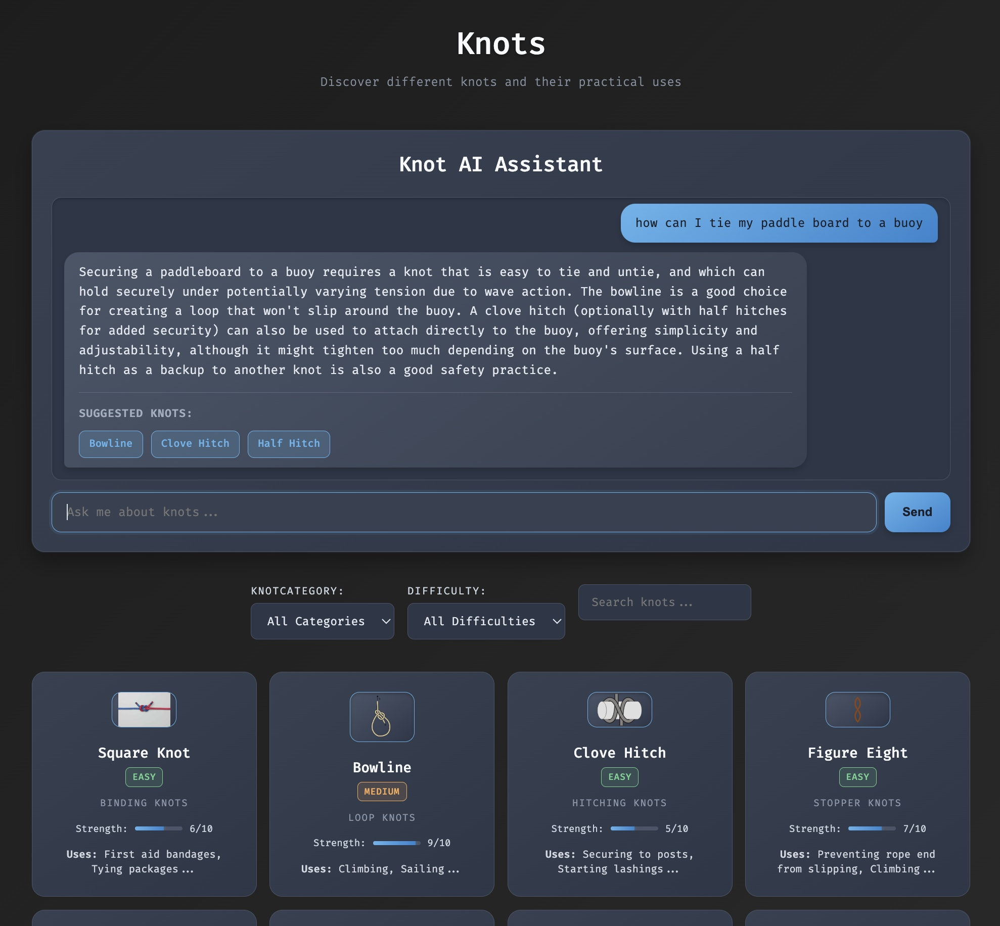

# Knots: A Modern Guide to Knot-Tying

Welcome to **Knots**, a sleek, modern web application designed to help you master the art of knot-tying. Whether you're a seasoned pro or a curious beginner, Knots offers a comprehensive resource for exploring, learning, and discovering the perfect knot for any situation.



## Features

-   **Interactive Knot Library**: Browse a rich collection of knots, beautifully displayed and categorized for easy navigation.
-   **Detailed Instructions**: Each knot includes clear, step-by-step instructions with high-quality illustrations.
-   **Advanced Filtering and Search**: Quickly find the knot you need with powerful filtering and search capabilities.
-   **AI-Powered Knot Assistant**: Ask natural language questions and get expert recommendations for the best knot for your specific needs.
-   **Direct Linking**: Share links to specific knots for easy reference.

## Getting Started

To get the Knots application up and running on your local machine, follow these simple steps.

### Prerequisites

-   [Node.js](https://nodejs.org/) (v18 or higher)
-   [npm](https://www.npmjs.com/)

### Installation

1.  **Clone the repository:**
    ```bash
    git clone https://github.com/your-username/knots.git
    cd knots
    ```

2.  **Install dependencies for both the frontend and backend:**
    ```bash
    # Install frontend dependencies
    cd frontend
    npm install

    # Install backend dependencies
    cd ../backend
    npm install
    ```

3.  **Set up your environment variables:**
    The backend requires an API key from an AI provider (e.g., Google Gemini) to power the AI Knot Assistant.

    -   Navigate to the `backend` directory:
        ```bash
        cd backend
        ```
    -   Create a new file named `.env`:
        ```bash
        touch .env
        ```
    -   Open the `.env` file and add your API key:
        ```
        GEMINI_API_KEY=your-api-key-here
        ```

### Running the Application

To run the application, you'll need to start both the frontend and backend servers.

-   **Start the backend server:**
    ```bash
    # From the /backend directory
    node index.js
    ```

-   **Start the frontend server:**
    ```bash
    # From the /frontend directory
    npm run dev
    ```

The frontend will be available at `http://localhost:5173/`.

## How to Contribute

We welcome contributions from the community! If you'd like to help improve Knots, please follow these steps:

1.  **Fork the repository.**
2.  **Create a new branch for your feature or bug fix.**
3.  **Make your changes and commit them with clear, descriptive messages.**
4.  **Push your changes to your fork.**
5.  **Submit a pull request to the `main` branch of the original repository.**

## License

This project is licensed under the MIT License. See the [LICENSE](LICENSE) file for details.